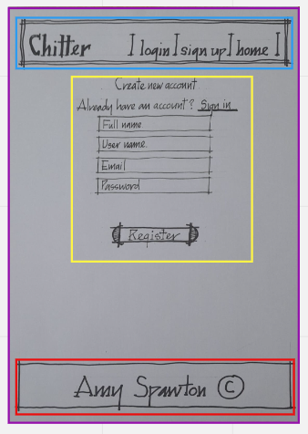
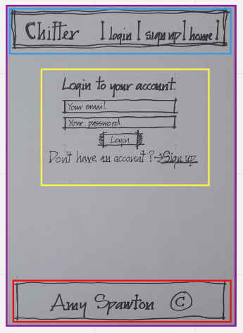
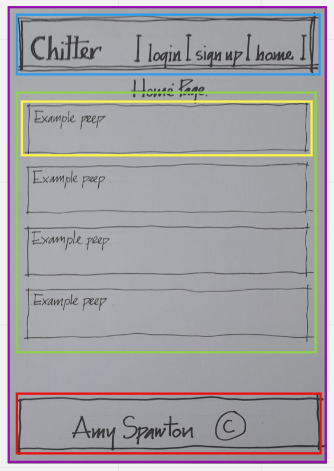
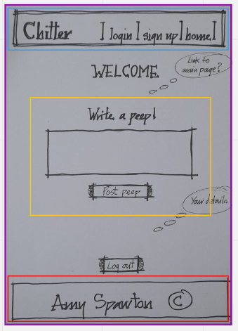

# Chitter Challenge
---

<details>
  <summary>Table of Contents</summary>
  <ol>
    <li><a href="#about-the-project">About The Project</a></li>
    <li><a href="#built-with">Built With</a></li>
    <li><a href="#getting-started">Getting Started</a></li>
    <li><a href="#mocks-and-component-heirachy">Mocks and Component heirachy</a></li>
    <li><a href="#problem-statements">Problem Statements</a></li>
    <li><a href="#user-stories-for-standard-criteria">User stories for standard criteria</a></li>
    <li><a href="#tests">Tests</a></li>
    <li><a href="#Thoughts-and-roadblocks">Thoughts and roadblocks</a></li>
    <li><a href="#project-review-and-roadmap">Project Review and Roadmap</a></li>
    <li><a href="#acknowledgements">Acknowledgements</a></li>
  </ol>
</details>

---

## About The Project

This project was our sixth (and last!!) technical assignment in the Digital Futures Academy programme.

The project was to create a full-stack application by implementing a backend server and a lovely, responsive front-end.
The projects purpose was to demonstrate my ability to implement a backend server and front-end that would comply with OOD principles and provide logic and routes to provide the functionality and to show I could connect that backend up to a well designed, responsive front-end with mulitple rendered pages showing the different parts of my application.

## Built With

### Front end
ReactJS App with the following imports:
- axios (for handling HTTP requests and responses)
- bootstrap (css styling import only)
- React Router (handling paths within the React App)

Testing - Jest with:
- testing-library/react
- testing-library/user-events
- jest.fn() for mocking axios get/post responses.

### Back end
NodeJS server using:
- Express (provide web framework for node)
- Mongoose (provide connection between server and MongoDB)
- body-parser (parsing middleware for handling json req.body)
- dotenv (environment variable loading)
- cors (cross origin resource sharing package)

Testing - Mocha with:
- chai (assertion library)
- chai-http (extend chai assertion library with HTTP integration)

### Back end (data persistence layer)
- MongoDB Atlas


## Getting Started

Clone the project and then from the project root directory:

1. Install the dependencies 
```
npm i // from both the cloned root directory of the front end and back end
```
2. Run tests:
```
$ npm test     
```
3. Run the server
```
$ npm start    
```
4. Using web browser, navigate to the localhost address/port provided in the server console.

## Mocks and Component heirachy

I have create 4 mocks to show the various pages of the application. A sign up page, a log in page, the homepage, and a create peep page. I will break these mocks into a component heirachy.

## Sign up page



| Components | Colour                                    |
| ---------- | ----------------------------------------- |
| **App**    | <span style="color: purple">Purple</span> |
| **Header** | <span style="color: blue">Blue</span>     |
| **SignUp** | <span style="color: yellow">Yellow</span> |
| **Footer** | <span style="color: red">Red</span>       |

## Log in page



| Components | Colour                                    |
| ---------- | ----------------------------------------- |
| **App**    | <span style="color: purple">Purple</span> |
| **Header** | <span style="color: blue">Blue</span>     |
| **LogIn**  | <span style="color: yellow">Yellow</span> |
| **Footer** | <span style="color: red">Red</span>       |

## Homepage



| Components     | Colour                                    |
| -------------- | ----------------------------------------- |
| **App**        | <span style="color: purple">Purple</span> |
| **Header**     | <span style="color: blue">Blue</span>     |
| **CreatePeep** | <span style="color: yellow">Yellow</span> |
| **HomePage**   | <span style="color: green">Green</span>   |
| **Footer**     | <span style="color: red">Red</span>       |

## Create peep



| Components     | Colour                                    |
| -------------- | ----------------------------------------- |
| **App**        | <span style="color: purple">Purple</span> |
| **Header**     | <span style="color: blue">Blue</span>     |
| **createPeep** | <span style="color: yellow">Yellow</span> |
| **Footer**     | <span style="color: red">Red</span>       |

## Problem Statements

This was a technical assignment I undertook as part of the Digital Futures Academy programme. The project was to implement a full stack application with both a backend server and a lovely responsive front-end.

The original user stories and requirements can be found in the file [./ChallengeInstructions.md](./ChallengeInstructions.md).

Prior to coding I worked through decomposing the user stories into smaller, more digestable stories to make writing the code smoother. I have included my decomposed user stories below. 

## User stories

Prior to coding I worked through decomposing the stories, diagrammatically mapping the routes and views and summarising through domain modelling. The outcomes of this process are recorded below.

### User stories for standard criteria

```
As a trainee software engineer
So that I can let people know what I am doing  
I want to post a message (peep) to chitter
```
```
As a trainee
So that I can see what others are saying  
I want to see all peeps in reverse chronological order
```
```
As a trainee
So that I can better appreciate the context of a peep
I want to see the time at which it was made
```
```
As a trainee
So that I can post messages on Chitter as me
I want to sign up for Chitter

As a trainee
So that only I can post messages on Chitter as me
I want to log in to Chitter
```
```
As a trainee
So that I can avoid others posting messages on Chitter as me
I want to log out of Chitter
```

## Tests

### Front end tests

### Header.test.js tests

1) Header matches snapshot

### Footer.test.js tests

1) Footer matches snapshot

### AllMessages.test.js tests

1) should show correct name
2) should show correct username
3) should show correct message

### login.test.js tests

1) should render Password Input type in the form
2) should render UserName Input type in the form
3) should render the username value when typed
4) should render the password value when typed
   
### signUp.test.js tests

1) should render display text input type in the form
2) should render display text input type in the form
3) should render the username value when typed
4) should render the Email value when typed
5) should render the password value when typed

### Back end tests

### login.test.js tests

1) should send an expected message if username is wrong
2) should send an expected message if password is wrong
3) should send an expected message if both are wrong
4) should Login Successfully

### signup.test.js tests

1) should create a Successful Registration for User

### addPeep.test.js tests

1) should return all of the Peeps as an array
2) should create a SuccessFul Post request


## Thoughts and roadblocks

I have had two major roadblocks during my time completing this challenge. Both of which took around 3 days to be solved each(whilst also completing other parts of the project inbetween).

The first was a problem with successfully posting data to my database. For some reason I just couldn't get it to work. I spent days trying to work it out and even got help from Lucas but in the end it ended up needing a low-tech solution to a high-tech problem! All i needed to do was delete my files from my computer and clone my code from my GitHub into a new folder. Then I was finally able to post data to the database! 

The second problem I had was that once I had successfully 'logged in' to my application the 'create peep' page wouldn't render. So I was unable to write a peep to send to the database as I couldnt get on to that page! I fiddled around with my code and researched and simply couldn't find a reason. I eventually got help and Ed was able to figure out that I hadn't made my 'log out' event listener into a call back function! So when I logged into the application it was immediately calling the `onclick` function on 'log out' and logging me back out without ever rendering the 'create peep' page. Once I added `() =>` to my code it was fixed! Who would think such a tiny piece of code could do so much damage! 


## Project Review and Roadmap

My overall learning from this project:
Thorough planning is key to working affectively. When creating a more complex application with both front end and back end you need to be able to plan the N-tier architecture properly so that you're able to understand how all the components and interfaces connect and speak to eachother. 


My technical learning from this project:
- Implemented testing based on user behavior for the React app front-end, including mocking serving responses.
- Implemented React routes to control user interface behaviour based on the state of React app (e.g. logged in vs not logged in).
- Implemented registration routes and implemented tests to provide assurance that they worked.
 

Improvements/additional features that could be included:
-I would have liked to spend more time on the styling of my application but unfortunately I ran out of time
-I would have liked to add validation to both the front end and the back end to make the application robust and secure.
- I would have liked my tests to have 100 percent coverage. Unfortunately there were a few tests I would have liked to do but was unable to make work.
 

 ## Acknowledgements

 A massive thank you to both Lucas and Ed for all your help and wisdom throughout my challenge!

